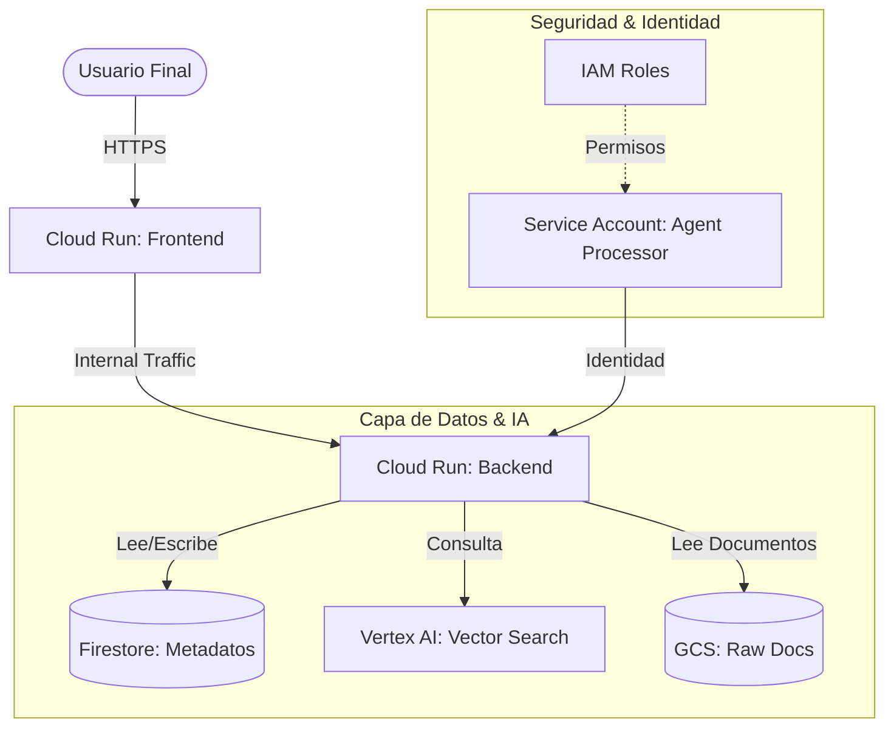

# Arquitectura del Agente de Conocimiento (ADK) 🏗️

Este documento describe la infraestructura desplegada en Google Cloud Platform (GCP) mediante Terraform. El sistema está diseñado para ser modular, seguro y escalable, soportando una aplicación RAG (Retrieval-Augmented Generation).

## 🧩 Diagrama Conceptual

## 🛠️ Componentes Principales

### 1. Computación (Compute Layer)
*   **Frontend (React):**
    *   Servicio Cloud Run público (`INGRESS_TRAFFIC_ALL`).
    *   Expone la interfaz de usuario.
    *   Se comunica con el backend a través de la URL inyectada.
*   **Backend (Agente):**
    *   Servicio Cloud Run privado (`INGRESS_TRAFFIC_INTERNAL_LOAD_BALANCER`).
    *   Contiene la lógica del agente y el procesador RAG.
    *   Ejecuta bajo la identidad de la Service Account del Agente.

### 2. Capa de Datos (Data Layer)
*   **Google Cloud Storage (GCS):**
    *   `input-a`: Bucket para la ingesta de documentos crudos (PDFs, TXTs).
    *   `output`: Bucket para resultados procesados o logs.
    *   **Seguridad:** En producción, `force_destroy` está desactivado para evitar borrados accidentales.
*   **Firestore:**
    *   Base de datos NoSQL para guardar el estado de las conversaciones, metadatos de documentos y configuración de usuarios.
    *   Modo "Nativo" para alto rendimiento.
*   **Vertex AI (Vector Search):**
    *   `Index`: Almacena los embeddings (vectores) de los documentos para búsqueda semántica.
    *   `Endpoint`: Punto de acceso para realizar consultas de similitud en tiempo real.

## 🛡️ Seguridad y Permisos (IAM)

El sistema sigue el principio de **Mínimo Privilegio (PoLP)**. No se usan claves de acceso estáticas; todo se gestiona mediante identidades gestionadas.

### Service Account: `agent-processor-sa`
Es la identidad central del backend. Tiene permisos específicos:
*   `roles/aiplatform.user`: Para consultar Vertex AI.
*   `roles/datastore.user`: Para leer/escribir en Firestore.
*   `roles/run.invoker`: Para invocar otros servicios (si fuera necesario).
*   `roles/storage.objectAdmin` (en bucket input): Control total sobre los archivos de entrada.
*   `roles/storage.objectCreator` (en bucket output): Solo puede escribir resultados, no borrar ni leer otros (según configuración).

## 🚀 Flujo de Trabajo (RAG)
1.  **Ingesta:** Los documentos se suben al bucket `input-a`.
2.  **Procesamiento:** El Backend detecta el archivo, extrae texto y genera embeddings.
3.  **Indexación:** Los embeddings se guardan en el `Vertex AI Index`.
4.  **Consulta:** El usuario pregunta en el Frontend -> Backend convierte pregunta a vector -> Consulta Vertex AI -> Recupera contexto -> Genera respuesta con LLM.
